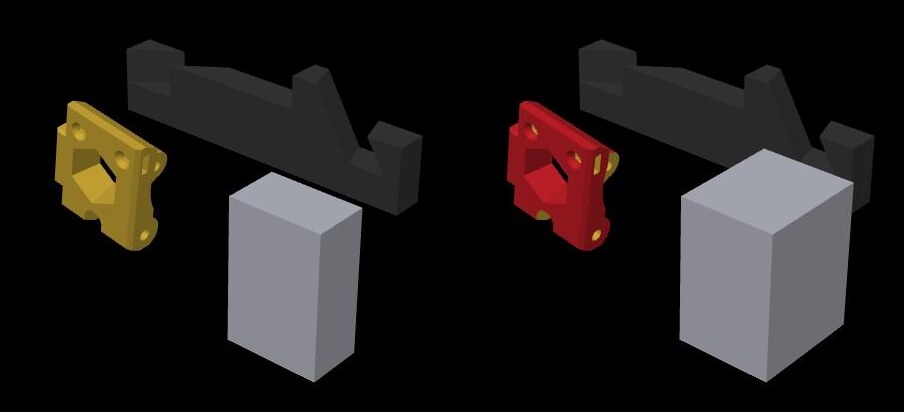

<div align="center">

<picture>
  
</picture>

# OrcaMCP

**OrcaSlicer, with an MCP server inside**

*An AI agent that can see your build plate and work it down to a single triangle*

[](https://github.com/okets/OrcaMCP/actions/workflows/build_all.yml)
[](https://github.com/okets/OrcaMCP/releases)
[](LICENSE.txt)
[](https://modelcontextprotocol.io/)

</div>

## What this is

OrcaMCP is OrcaSlicer with a [Model Context Protocol](https://modelcontextprotocol.io/) server
built into the application. Point Claude Code, or any MCP client, at it and the agent gets 78
tools that do what you do with the mouse: load and cut models, paint them, change any setting,
slice, look at the result, and send it to the printer. It runs on your machine and talks to your
printers over your own network. Nothing goes to a cloud.

Two things separate this from wrapping a command-line slicer.

**The agent can see.** It renders the plate from any camera it likes, reads the image, and can ask
which triangle sits under a given pixel. Then it paints that feature, renders again, and checks
its own work. Every tool response also carries the slicer's live warnings, so a prime tower off
the bed or a G-code conflict reaches the agent the moment it appears, not after a failed print.

**The tools are fine-grained.** Paint per triangle, in color, support, seam and fuzzy-skin modes.
Override settings per object and per layer range. Place brim ears at points. Move the prime
tower. Create mixed-filament slots and set flush volumes. If the GUI has a gizmo for it, there is
a tool for it, and the tool writes the same data the gizmo does.

<div align="center">


*Same camera, two renders. Between them the agent asked `pick_facet` what lay under a pixel of the
gold bracket, got back that part's mesh and facet, and painted the connected shell with filament
slot 3. The prime tower grew on its own because a third filament joined the plate. Rendered by
`render_plate_view` on a Creator 5 Pro profile. Nothing here was touched by hand.*
</div>

## Who it is for

**You have just unboxed a printer.** You have a part, a spool, and a slicer with four hundred
settings. Tell the agent what the part is for and what it is made of. It picks layer height,
walls, infill and supports, says why, slices, and shows you the plate before anything prints.
When a print fails anyway, the reason was usually in a warning you closed without reading. Here
every warning is in the tool response, so the agent reads it for you.

**You print in color.** Four spools loaded, a model with a dozen features, and a paint gizmo that
takes an afternoon. Say which feature should be which color. The agent finds the shells, points
at them in a render, and paints them. Ask what else you could make from those four spools and it
enumerates the reachable mixes, creates the ones you pick as new slots, and recalculates the
flush volumes. When a color is not reachable from what is loaded, it says so instead of
inventing a ratio.

**You design parts that have to hold.** A bracket needs three walls and dense infill in its first
ten millimetres and can be fast above that. Per-object settings, per-layer-range settings and
adaptive layer heights are all one request away, and the agent can read the estimate back to you
before you commit to the slower version.

**Your model is bigger than the bed.** Cut it at a height, keep both halves, lay each one flat,
orient for the fewest supports, arrange, and look at the result. That is one sentence to the
agent and a render back.

**You run the same job every week.** Twelve steps you know by heart, and the mistakes happen on
the boring ones. The whole flow is scriptable against the real slicer, from a chat or from a
script, with undo.

**You print models other people made.** They arrive as an STL with no orientation, or a 3MF
from a slicer you do not run, and the first attempt fails at the overhang you did not notice.
Ask the agent to open it, lay it on its best face, check it fits your bed, and set it up for your
printer and the material you actually have loaded. It shows you the plate before you commit, and
the slicer's warnings reach it before the print starts.

## What a session looks like

The first two conversations below were run exactly as written, against a Creator 5 Pro profile,
while this README was being written. The numbers are what the tools returned. The remaining
examples describe the tools as documented in the [tools reference](docs/tools/reference.md).

---

> Show me the plate from the front right, then make the small bracket red.

The agent rendered the plate, handed the render's camera back with the pixel it meant, and got
the bracket's mesh, facet 3094, the surface point in plate millimetres and the normal there. It
seeded a connected fill from that facet and painted the shell with slot 3: 2,508 of the part's
3,586 triangles, 77% of its surface area. The second render is the same camera again.

Painting put a third filament on the plate, so the slicer generated a prime tower at its default
spot on the plate's edge, and the next response carried the slicer's own error: the tower was
partly outside the printable area. The agent moved it beside the parts. The response listed the
allowed range and reported no conflicts, and the warning count was zero on the next call.

`render_plate_view` · `pick_facet` · `paint_object` · `set_prime_tower_position`

---

> What colors can I mix from what is loaded?

Loaded: gold PETG, dark grey ABS, red ABS, translucent grey PLA. The palette tool found three
reachable mixes, all from the two ABS spools, from a deep maroon at 70/30 to a brick red at
30/70. It also named ten hues you cannot get from these spools, red through magenta. It did not
pretend otherwise. Ask for one of the three by name and it becomes a new filament slot, with the
flush volumes recalculated.

`get_filaments` · `get_color_palette` · `suggest_color_mix` · `set_mixed_filament` · `auto_calc_flush_volumes`

---

> This figure is 300 mm tall. Cut it at the waist, lay both halves flat, and arrange them.

Cut at a Z height keeping both pieces, flatten each onto its best face, orient for the fewest
supports, arrange, render. Every transform reports the object's new position and whether it is
on the bed, so the agent knows before you do if a half landed off the plate.

`cut_object` · `flatten_object` · `auto_orient` · `arrange_objects` · `render_plate_view`

---

> It is a load-bearing PETG bracket. Set it up properly.

Three walls and 40% gyroid on the object, a layer range over the first 10 mm with denser infill,
adaptive layer height for the curved top, and the reasoning written out. Settings are applied by
name; the agent can list the valid keys for any category before it guesses.

`get_valid_config_keys` · `apply_config` · `set_object_config` · `set_object_layer_range` · `apply_adaptive_layer_height`

---

> Slice it, tell me how long it takes, and if it is under an hour send it to the C5P.

Slice the current plate, poll until done, read back the estimate. The two parts above came back
as 3 h 20 min, 315 layers, 34 g over three filaments and 506 tool changes, so the agent did not
send, and could say why: three colors share most layers, so the tool changes dominate. The
status response also carried the slicer's warning that the bracket has floating regions and wants
supports. When the answer is yes, sending opens the slicer's own send dialog with the file
already selected; the last click is yours.

`slice_all` · `get_slicing_status` · `get_print_estimate` · `send_to_printer`

---

> That looked wrong. Go back.

`undo`

## Built for agents

- **No dialog ever blocks a call.** Confirmations that would open a modal are answered with the
  safe choice and returned in the response as messages. File pickers are never opened; tools that
  need a path ask for one.
- **Warnings travel with the data.** Most responses carry the slicer's active warnings with a count,
  so an agent can confirm a problem is gone, not just that it stopped looking.
- **Vision is a first-class tool.** Renders from any camera, at any resolution, saved to a file or
  returned as base64 for clients without disk access. A render's camera can be handed back to
  `pick_facet` to turn a pixel into a facet.
- **Read-back for everything it writes.** Paint coverage per part and per mode, per-object
  overrides, layer ranges, plate occupancy including brim and prime tower, live printer state.
- **Undo and redo** are tools too.
- **Any MCP client.** The transport is stdio to a one-file Python bridge, HTTP from the bridge to
  the app. Claude Code picks it up from the repository's `.mcp.json`; anything else that speaks MCP
  works the same way.
- **Local.** The app, the bridge and the printer connection all live on your network.

## Quick start

1. **Get the app.** Download a [release](https://github.com/okets/OrcaMCP/releases) or
   [build from source](docs/setup/building.md).

2. **Connect Claude Code.** Open this repository folder in Claude Code; the included `.mcp.json`
   registers the server. To use it from anywhere, add to `~/.claude.json`:

   ```json
   {
     "mcpServers": {
       "orca-slicer": {
         "command": "python3",
         "args": ["/path/to/OrcaMCP/scripts/orcamcp-bridge.py"]
       }
     }
   }
   ```

3. **Ask it to start the slicer.** The bridge's `start_orca` tool launches the app, so "start
   Orca" is a valid first message. To check by hand:

   ```bash
   curl -s http://localhost:13618/mcp | jq .
   ```

4. **Talk to it.**

   ```
   "What's on the plate?"
   "Load ~/Downloads/bracket.step and show me it from the front."
   "Three walls, 30% infill, tree supports. Slice it and tell me how long."
   ```

## Printer support

Sending a job goes through OrcaSlicer's own print-host support, so every host OrcaSlicer can send
to works here: OctoPrint, Klipper and Moonraker, Bambu, Prusa, FlashForge and the rest. Live
status and printer control are available where the host exposes them.

### FlashForge Creator 5 and Creator 5 Pro

The Creator 5 Pro is my main printer, so these two machines are fully supported and will stay
maintained: this is the slicer I print with every day. The aim is a better experience than the
stock software. You get a device console built around what the printer actually exposes, with all
four nozzles, the material station in its real colors, live job progress and the camera; four-tool
workflows with color mixing; material mapping that reads what is loaded; and current OrcaSlicer
underneath rather than a vendor fork that trails it. Everything runs over the printer's own local
API, with no cloud account and no closed network plugin. Details, limits and setup are in
[FlashForge Creator 5 and Creator 5 Pro](docs/printers/flashforge-creator-5.md).

## Tools

78 tools, by category. Parameters and examples for each are in the
[tools reference](docs/tools/reference.md).

| Category | Tools |
|----------|-------|
| **Scene** | `get_scene_info`, `new_project`, `load_project`, `save_project`, `export_3mf` |
| **Models** | `load_model`, `auto_orient`, `arrange_objects`, `get_object_info`, `rename_object`, `set_object_printable` |
| **Transforms** | `move_object`, `rotate_object`, `scale_object`, `mirror_object`, `flatten_object`, `clone_object`, `cut_object`, `delete_object`, `transform_objects` |
| **Plates** | `add_plate`, `select_plate`, `delete_plate`, `set_prime_tower_position` |
| **Config** | `get_presets`, `get_edited_presets`, `select_preset`, `apply_config`, `clone_preset`, `save_preset`, `delete_preset`, `reset_preset`, `get_valid_config_keys` |
| **Per-object** | `get_object_config`, `set_object_config`, `reset_object_config`, `get_object_layer_ranges`, `set_object_layer_range`, `delete_object_layer_range` |
| **Filaments and color** | `get_filaments`, `set_object_filament`, `set_mixed_filament`, `delete_mixed_filament`, `get_flush_volumes`, `set_flush_volumes`, `auto_calc_flush_volumes`, `get_toolchanger_config`, `suggest_color_mix`, `get_color_palette` |
| **Painting** | `paint_object`, `get_object_paint`, `clear_object_paint`, `set_brim_ears`, `get_object_components`, `pick_facet` |
| **Slicing** | `slice_all`, `get_slicing_status`, `export_gcode`, `get_print_estimate`, `apply_adaptive_layer_height`, `clear_adaptive_layer_height` |
| **Vision** | `render_plate_view`, `get_preview_base64`, `set_gcode_view_type` |
| **Printers** | `get_printers`, `select_printer`, `add_physical_printer`, `discover_printers`, `send_to_printer`, `get_printer_status`, `printer_control`, `list_printer_files`, `print_printer_file`, `match_project_to_printer` |
| **History and info** | `undo`, `redo`, `get_server_info` |
| **Bridge only** | `start_orca` |

## Architecture

```
┌─────────────────┐     stdio     ┌──────────────────┐     HTTP      ┌─────────────┐
│   MCP client    │ ◄───────────► │ orcamcp-bridge   │ ◄───────────► │  OrcaMCP    │
│ (Claude Code…)  │               │    (Python)      │               │ Port 13618  │
└─────────────────┘               └──────────────────┘               └─────────────┘
```

The server is embedded in the application because rendering and most model operations must run
on the GUI thread. The bridge exists because a GUI application cannot own stdio. See the
[architecture overview](docs/architecture/overview.md) and the
[threading model](docs/architecture/threading-model.md).

## Documentation

| Document | Description |
|----------|-------------|
| [Tools reference](docs/tools/reference.md) | Every tool, with parameters and examples |
| [Workflows](docs/tools/workflows.md) | Common multi-tool patterns |
| [Printers](docs/printers/) | FlashForge Creator 5 support and the LAN API |
| [Architecture](docs/architecture/) | System design, threading model, transport layer |
| [ADRs](docs/adr/) | Architecture decision records |
| [Setup](docs/setup/) | Building, configuration, troubleshooting |
| [Contributing](docs/contributing/) | Adding tools, code style |
| [CLAUDE.md](CLAUDE.md) | Quick reference for coding agents working on this repository |

## Building from source

```bash
git clone https://github.com/okets/OrcaMCP.git
cd OrcaMCP
./build_release_macos.sh -s -x    # macOS
./build_release.sh                # Linux
```

See the [building guide](docs/setup/building.md) for Windows and for the dependency build.

## Configuration

| Variable | Default | Description |
|----------|---------|-------------|
| `ORCAMCP_HOST` | `localhost` | OrcaSlicer HTTP host |
| `ORCAMCP_PORT` | `13618` | OrcaSlicer HTTP port |
| `ORCAMCP_TIMEOUT` | `120` | Request timeout in seconds |
| `ORCAMCP_DEBUG` | unset | Debug logging to stderr |

See the [configuration guide](docs/setup/configuration.md) for more.

## Project origin

OrcaMCP is a fork of [OrcaSlicer](https://github.com/SoftFever/OrcaSlicer) that tracks upstream
and adds the embedded MCP server, the FlashForge Creator 5 support, and the color-mixing tools.

## License

GNU Affero General Public License v3.0, the same license as OrcaSlicer. See
[LICENSE.txt](LICENSE.txt).

## Acknowledgments

- [OrcaSlicer](https://github.com/SoftFever/OrcaSlicer), the slicer this project is built on
- [Anthropic](https://anthropic.com), for the Model Context Protocol specification
- [PrusaSlicer](https://github.com/prusa3d/PrusaSlicer) and
  [BambuStudio](https://github.com/bambulab/BambuStudio), the upstream slicer projects

## Contributing

Contributions are welcome. See [adding new tools](docs/contributing/adding-tools.md) and
[code style](docs/contributing/code-style.md).

## Support

- [GitHub Issues](https://github.com/okets/OrcaMCP/issues)
- [docs/](docs/)
