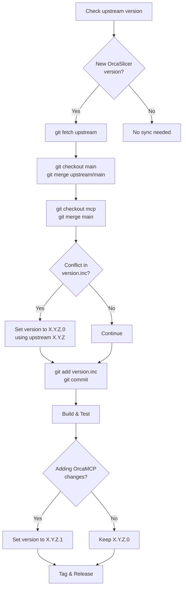
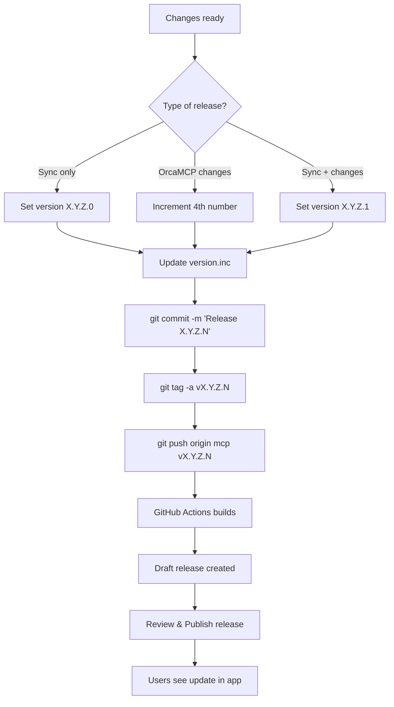
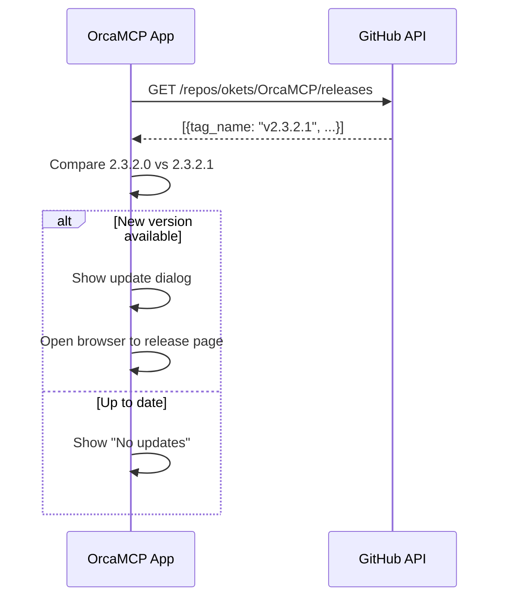

# OrcaMCP Release & Update Process

---

## Versioning Scheme

```
X.Y.Z.N
│ │ │ └─ OrcaMCP release number (0 = sync only, 1+ = has OrcaMCP changes)
└─┴─┴─── OrcaSlicer version (always taken from upstream)
```

| Version | Meaning |
|---------|---------|
| `2.3.2.0` | Synced to OrcaSlicer 2.3.2, no OrcaMCP changes |
| `2.3.2.1` | OrcaSlicer 2.3.2 + OrcaMCP changes |
| `2.4.0.0` | Synced to OrcaSlicer 2.4.0 (4th number resets) |

### Version Update Rules

| Situation | Version Change |
|-----------|----------------|
| Sync to new upstream X.Y.Z | → `X.Y.Z.0` (reset 4th to 0) |
| OrcaMCP changes, same upstream | → increment 4th number |
| Sync + OrcaMCP changes together | → `X.Y.Z.1` |

---

## Upstream Sync Workflow



### Sync Commands

```bash
# 1. Check versions
grep "SoftFever_VERSION" version.inc                    # Current
gh release view --repo SoftFever/OrcaSlicer             # Upstream

# 2. Fetch and merge
git fetch upstream
git checkout main && git merge upstream/main
git checkout mcp && git merge main

# 3. Resolve version.inc → set to X.Y.Z.0 (upstream version + .0)

# 4. Push
git push origin main mcp
```

---

## Release Workflow



### Release Commands

```bash
# 1. Set version in version.inc
# Edit: set(SoftFever_VERSION "X.Y.Z.N")

# 2. Commit and tag
git add -A
git commit -m "Release X.Y.Z.N"
git tag -a vX.Y.Z.N -m "Release X.Y.Z.N: description"
git push origin mcp vX.Y.Z.N

# 3. Wait for GitHub Actions (~15 min)
# 4. Publish draft release at github.com/okets/OrcaMCP/releases
```

---

## User Update Flow



**API Endpoint:** `https://api.github.com/repos/okets/OrcaMCP/releases`

---

## GitHub Actions

The workflow (`.github/workflows/release.yml`) triggers on tag push:

```yaml
on:
  push:
    tags:
      - 'v*'
```

| Step | First Build | Subsequent Builds |
|------|-------------|-------------------|
| Tag pushed | instant | instant |
| Build Deps (cached) | 30-60 min each | **0s** (cached) |
| Build Linux | ~50 min | ~50 min |
| Build Windows | ~1 hour | ~1 hour |
| Build macOS (universal) | ~2 hours | ~2 hours |
| Create release | ~1 min | ~1 min |

**Notes:**
- All platforms build **in parallel**, so total wall time ≈ macOS time (~2 hours)
- macOS is slowest because it builds a **universal binary** (ARM + Intel)
- Dependencies are cached based on `hashFiles('deps/**')` - only rebuilt if deps change
- Large C++ codebase (~500K lines) means long compile times are unavoidable

---

## Quick Reference

### Check Versions
```bash
# Current OrcaMCP
grep "SoftFever_VERSION" version.inc

# Latest upstream
gh release view --repo SoftFever/OrcaSlicer --json tagName -q .tagName

# Compare
git fetch upstream && git show upstream/main:version.inc | grep SoftFever_VERSION
```

### Create Release
```bash
git tag -a v2.3.2.1 -m "Description" && git push origin v2.3.2.1
```

### Delete Tag (if mistake)
```bash
git tag -d v2.3.2.1
git push origin :refs/tags/v2.3.2.1
```

---

## Version History Example

```
v2.3.2.0  ← Synced to OrcaSlicer 2.3.2
v2.3.2.1  ← Added MCP tool
v2.3.2.2  ← Bug fixes
v2.4.0.0  ← Synced to OrcaSlicer 2.4.0 (reset)
v2.4.0.1  ← OrcaMCP improvements
v2.4.1.0  ← Synced to OrcaSlicer 2.4.1 (reset)
```
